# About

This module covers fundamentals of running serverless Spark on GCP from the BigQuery UI through a practical and basic set of examples to get you quick-started. 

## 1. Pre-requisites

a) The Spark on BigQuery feature, currently (Feb/March 2022) needs enabling for Argolis. Submit a request [here](https://docs.google.com/forms/d/e/1FAIpQLSccIXlE5gJNE0dNs6vQvCfrCcSjnoHqaW2lxpoVkAh56KLOwA/viewform) with your Argolis user principal name - admin@\<your-org-name\> ... example admin@\<your-ldap\>.altostrat.com. <br>
  
b) Completion of the prior module
  <br>
  
<hr>
  
## 2. Dependency - storage bucket for code 

The code authored in the BigQuery UI gets packaged and persisted in this storage bucket, by serverless Spark on Dataproc.<br> 
Lets create a bucket.
<br>
  
In cloud shell on the cloud console, run the below-
```
#Replace trident with the base prefix from module 1
BASE_PREFIX="trident"  

#Replace with your details
ORG_ID=<YOUR_ID>.altostrat.com                              
ADMINISTRATOR_UPN_FQN=admin@$ORG_ID 
PROJECT_ID=<YOUR_PROJECT_ID>
PROJECT_NBR=<YOUR_PROJECT_NBR>

BIGSPARK_CODE_BUCKET=gs://$PROJECT_KEYWORD-bigspark-$PROJECT_NBR-code
BIGSPARK_STAGE_BUCKET=gs://$PROJECT_KEYWORD-bigspark-$PROJECT_NBR-stage
LOCATION=us-central1
  
gsutil mb -p $PROJECT_ID -c STANDARD -l $LOCATION -b on $BIGSPARK_CODE_BUCKET
gsutil mb -p $PROJECT_ID -c STANDARD -l $LOCATION -b on $BIGSPARK_STAGE_BUCKET
```
<hr>
  

## 3. Navigate to the BigQuery UI for serverless PySpark

Follow the steps below to get to the BigQuery UI for serverless PySpark-
  
  
  
<br><br>
  
  
  
<br><br>
  
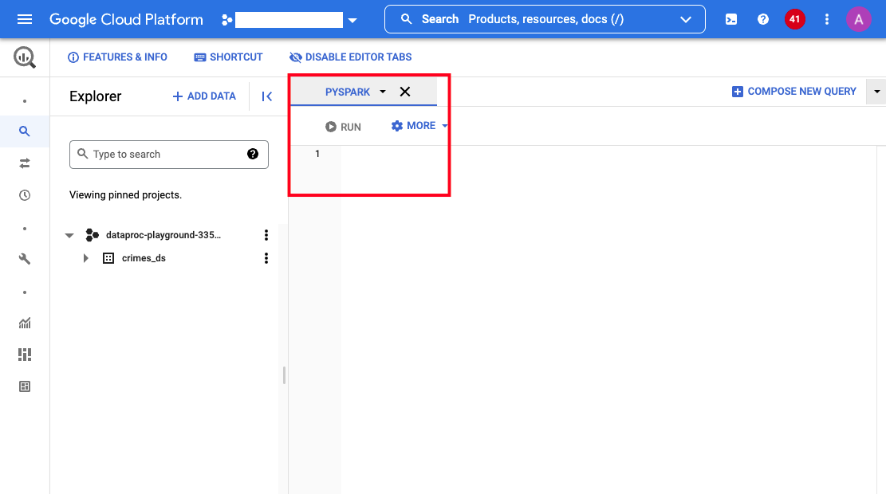  
  
  
<br><br>
  
  
  
  
<br><br>
Select the storage bucket you created in step 2
  
  
  
<br><br>
  
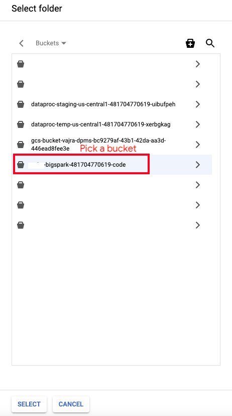 

<br><br>
Select the subnet you created in the foundational module and save
  
  
 
  
<br><br>
You should see a user interface as shown below-
  
  
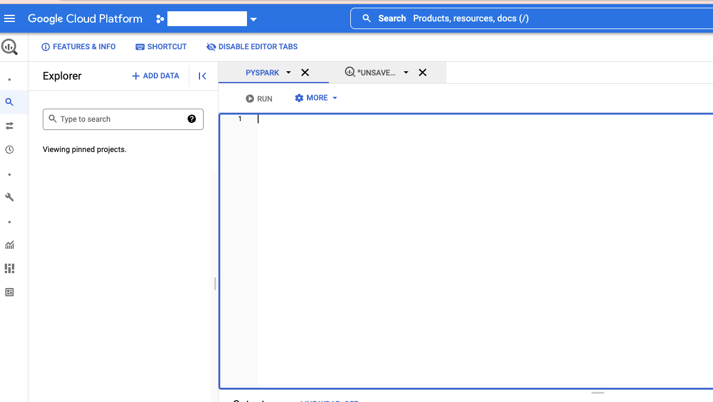 
   
<hr>

## 4. Lets run a word count sample

We are going to read data from a BigQuery public dataset and run a distributed computation (word count) on it in serverless Spark.
  
### 4.a. Our data
  
We are going to read data from the public dataset in BigQuery at ```bigquery-public-data.samples.shakespeare```. <br>
Here is a pictorial overview-
  
 
  
### 4.b. The PySpark code
  
This code reads the data in the table from 4.a, removes stopwords, and prints the top 20 corpuses with max word counts to the UI.
 
```
from pyspark.sql import SparkSession
from pyspark.ml.feature import StopWordsRemover
from pyspark.sql import functions as F

spark = SparkSession.builder \
  .appName('Top Shakespeare words')\
  .getOrCreate()

# Read data from BigQuery
df = spark.read \
  .format('bigquery') \
  .load('bigquery-public-data.samples.shakespeare')


# Convert words to lowercase and filter out stop words
df = df.withColumn('lowered', F.array(F.lower(df.word)))
remover = StopWordsRemover(inputCol='lowered', outputCol='filtered')
df = remover.transform(df)

# Create (count, word) struct and take the max of that in each corpus
df.select(df.corpus, F.struct(df.word_count, df.filtered.getItem(0).alias('word')).alias('count_word')) \
  .where(F.col('count_word').getItem('word').isNotNull()) \
  .groupby('corpus') \
  .agg({'count_word': 'max'}) \
  .orderBy('corpus') \
  .select(
     'corpus',
     F.col('max(count_word)').getItem('word').alias('word'),
     F.col('max(count_word)').getItem('word_count').alias('count')) \
  .show(20)

```
  
### 4.c. Paste the code and run
  
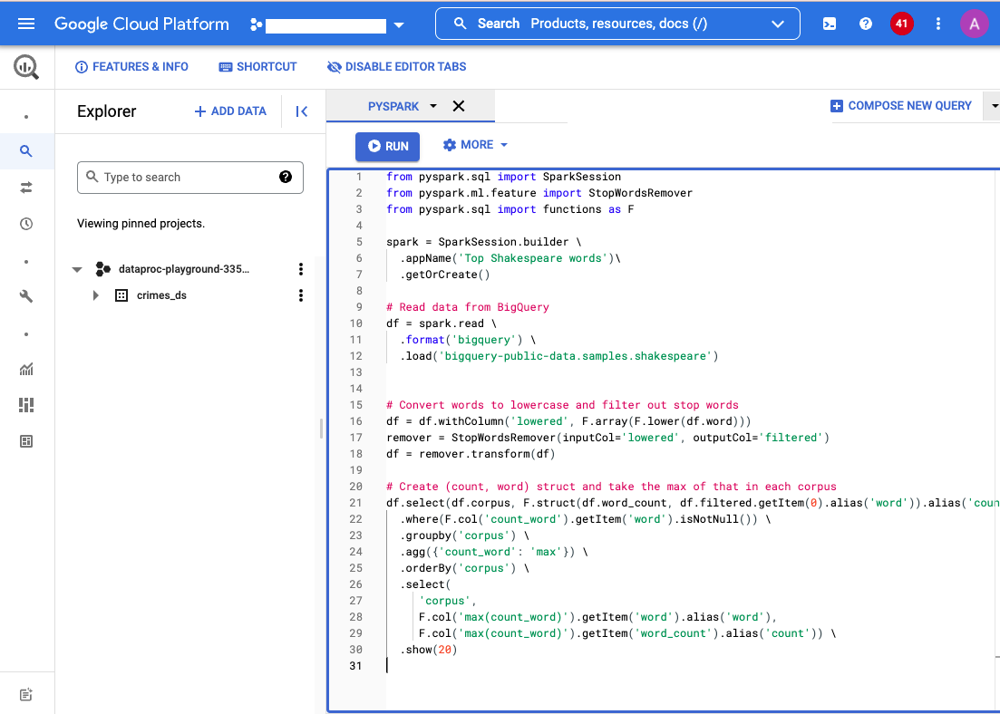 

The results should something like this-
```
Using the default container image
PYSPARK_PYTHON=/opt/dataproc/conda/bin/python
JAVA_HOME=/usr/lib/jvm/temurin-11-jdk-amd64
SPARK_EXTRA_CLASSPATH=
:: loading settings :: file = /etc/spark/conf/ivysettings.xml
22/02/17 18:13:58 INFO DirectBigQueryRelation: Querying table bigquery-public-data.samples.shakespeare, parameters sent from Spark: requiredColumns=[corpus,word_count,word], filters=[]
22/02/17 18:13:58 INFO DirectBigQueryRelation: Going to read from bigquery-public-data.samples.shakespeare columns=[corpus, word_count, word], filter=''
22/02/17 18:14:01 INFO DirectBigQueryRelation: Created read session for table 'bigquery-public-data.samples.shakespeare': projects/.........

+--------------------+----------+-----+
|              corpus|      word|count|
+--------------------+----------+-----+
|        1kinghenryiv|     henry|  252|
|        1kinghenryvi|       thy|  157|
|        2kinghenryiv|  falstaff|  199|
|        2kinghenryvi|      thou|  187|
|        3kinghenryvi|      king|  249|
|allswellthatendswell|  parolles|  165|
|  antonyandcleopatra|    antony|  284|
|         asyoulikeit|  rosalind|  217|
|      comedyoferrors|  syracuse|  204|
|          coriolanus|coriolanus|  207|
|           cymbeline|    imogen|  137|
|              hamlet|    hamlet|  407|
|        juliuscaesar|    brutus|  235|
|          kinghenryv|      king|  217|
|       kinghenryviii|     henry|  122|
|            kingjohn|      king|  176|
|            kinglear|      king|  243|
|       kingrichardii|       thy|  160|
|      kingrichardiii|      king|  201|
|     loverscomplaint|         o|   10|
+--------------------+----------+-----+
only showing top 20 rows
```
  
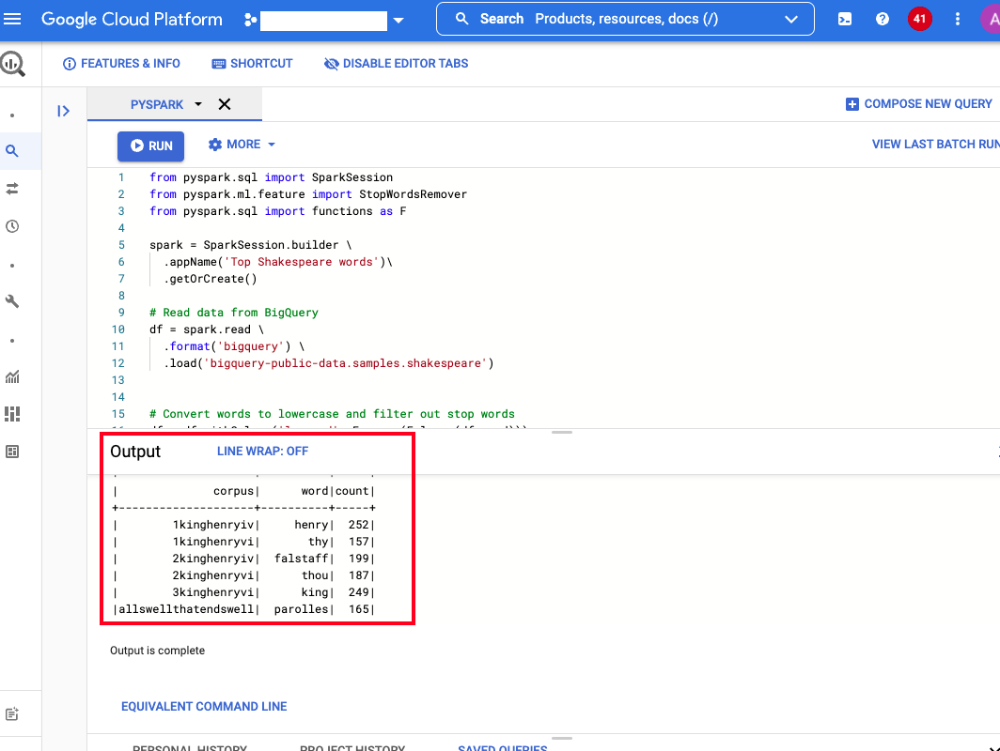 


## 5. Lets analyze Chicago crimes dataset with Spark SQL

### 5.a. Paste the code below that analyzes crimes by year & run
  
```
from pyspark.sql import SparkSession

spark = SparkSession.builder \
  .appName('Chicago Crimes Analysis')\
  .getOrCreate()

# Read data from BigQuery
baseDF = spark.read \
  .format('bigquery') \
  .load('bigquery-public-data.chicago_crime.crime')

# Create a temporary view
baseDF.createOrReplaceTempView("chicago_crimes")

# Crimes count by year
crimesByYearDF=spark.sql("SELECT year,count(*) AS crime_count FROM chicago_crimes GROUP BY year ORDER BY year;")
crimesByYearDF.show()

# Crimes count by year for specific crime types
crimesByYearAndTypeDF=spark.sql("SELECT cast(cast(year as string) as date) as case_year, primary_type as case_type, count(*) AS crime_count FROM chicago_crimes where primary_type in ('BATTERY','ASSAULT','CRIMINAL SEXUAL ASSAULT') GROUP BY case_year,primary_type ORDER BY case_year;")
crimesByYearAndTypeDF.show()
```

The resuts should be something like this-
```
+----+-----------+
|year|crime_count|
+----+-----------+
|2001|     485821|
|2002|     486782|
|2003|     475969|
|2004|     469411|
|2005|     453756|
|2006|     448159|
|2007|     437069|
|2008|     427138|
|2009|     392805|
|2010|     370455|
|2011|     351935|
|2012|     336222|
|2013|     307402|
|2014|     275674|
|2015|     264622|
|2016|     269666|
|2017|     268905|
|2018|     268539|
|2019|     260932|
|2020|     211558|
+----+-----------+
only showing top 20 rows

22/02/17 23:13:05 INFO DirectBigQueryRelation: Querying table bigquery-public-data.chicago_crime.crime, parameters sent from Spark: requiredColumns=[primary_type,year],.....


+----------+--------------------+-----------+
| case_year|           case_type|crime_count|
+----------+--------------------+-----------+
|2001-01-01|CRIMINAL SEXUAL A...|         27|
|2001-01-01|             BATTERY|      93452|
|2001-01-01|             ASSAULT|      31384|
|2002-01-01|             BATTERY|      94150|
|2002-01-01|CRIMINAL SEXUAL A...|         22|
|2002-01-01|             ASSAULT|      31521|
|2003-01-01|CRIMINAL SEXUAL A...|         28|
|2003-01-01|             ASSAULT|      29477|
|2003-01-01|             BATTERY|      88379|
|2004-01-01|CRIMINAL SEXUAL A...|         28|
|2004-01-01|             ASSAULT|      28850|
|2004-01-01|             BATTERY|      87136|
|2005-01-01|CRIMINAL SEXUAL A...|         27|
|2005-01-01|             BATTERY|      83964|
|2005-01-01|             ASSAULT|      27066|
|2006-01-01|             ASSAULT|      25945|
|2006-01-01|             BATTERY|      80666|
|2006-01-01|CRIMINAL SEXUAL A...|         38|
|2007-01-01|CRIMINAL SEXUAL A...|         45|
|2007-01-01|             ASSAULT|      26313|
+----------+--------------------+-----------+
only showing top 20 rows
```

Here is the output in the GUI-

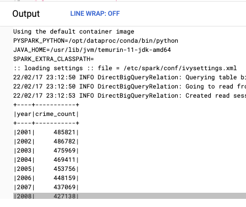 

<br><br>

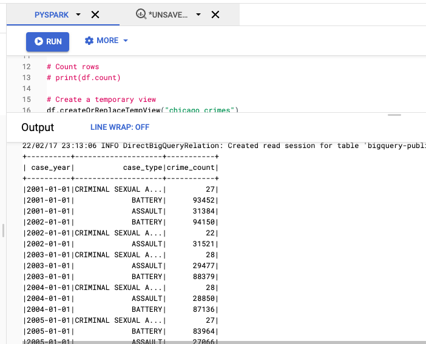

<br><br>

### 5.b. Lets modify the above to write to a BQ table

Lets write this dataframe to a table-
```
# Crimes count by year
crimesByYearDF=spark.sql("SELECT year,count(*) AS crime_count FROM chicago_crimes GROUP BY year ORDER BY year;")
```

#### 5.b.1. Create a BQ dataset and table

Create a dataset-
```
bq --location=$LOCATION mk \
--dataset \
$PROJECT_ID:chicago_crimes_datamart
```


Create a table-
```
bq mk \
--table \
$PROJECT_ID:chicago_crimes_datamart.crimes_by_year \
crimes_year:INTEGER,crimes_count:NUMERIC
```

#### 5.b.2. Run the PySpark code below to persist the crimes count by year to BigQuery
Edit the reference to the (a) table in the code below with your table with **project and dataset prefix**, and the storage stage bucket with yours and run-

```
from pyspark.sql import SparkSession,DataFrameWriter

spark = SparkSession.builder \
  .appName('Chicago Crimes Analysis')\
  .getOrCreate()

# Storage bucket for BigQuery connector to stage before persisting to BigQuery
spark.conf.set('temporaryGcsBucket', "<your-PROJECT_KEYWORD>-bigspark-<your-PROJECT_NBR>-stage")

# Read data from BigQuery
baseDF = spark.read \
  .format('bigquery') \
  .load('bigquery-public-data.chicago_crime.crime')

# Create a temporary view
baseDF.createOrReplaceTempView("chicago_crimes")

# Crimes count by year
crimesByYearDF=spark.sql("SELECT year,count(*) AS crime_count FROM chicago_crimes GROUP BY year ORDER BY year;")
crimesByYearDF.show()

# Persist to BigQuery
crimesByYearDF.write.format("bigquery").option("table","chicago_crimes_datamart.crimes_by_year").mode('overwrite').save()
```

<br><br>
You can get to the logs from the dataproc->serverless->batches->job GUI directly as shown below-


<br><br>

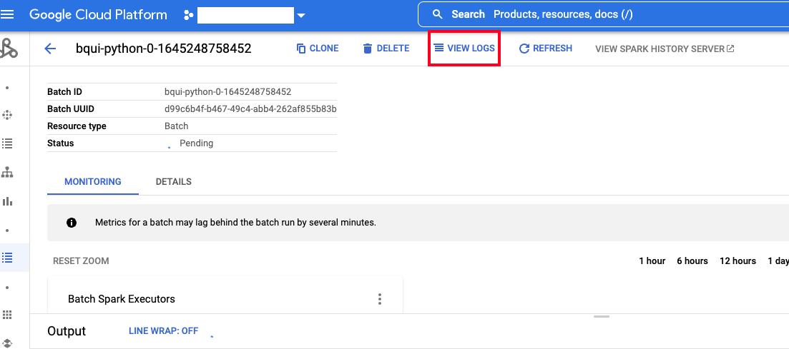

<br><br>

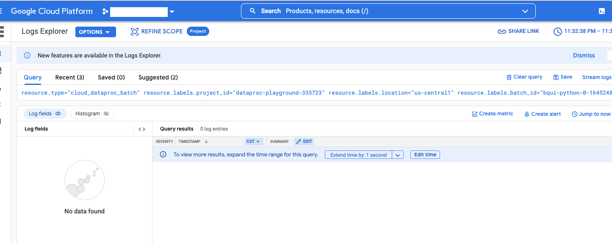

<br><br>

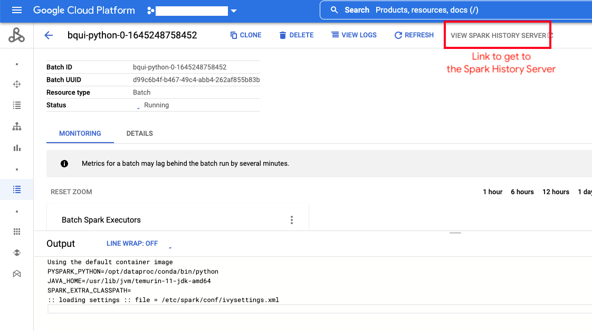

<br><br>

Lets switch to BigQuery to validate the writes-


<br><br>
<hr>

## 6. How do you look at serverless jobs executed in Dataproc?

The listing can be found in the Dataproc -> Serverless -> Batches UI.<br>
By clicking on the specific job, the execution logs can be visualized.<br>
These logs are not permanently available, use Dataproc persistent Spark History Server to avoid losing logs after 24 hours.<br>

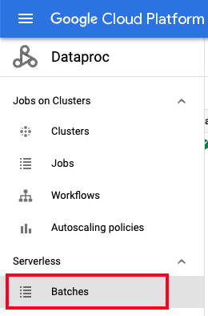

<br><br>

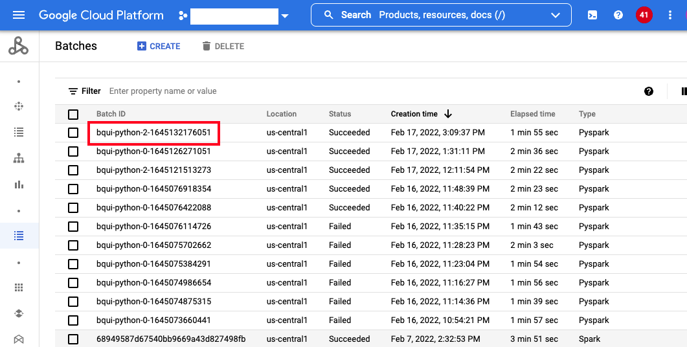

<br><br>

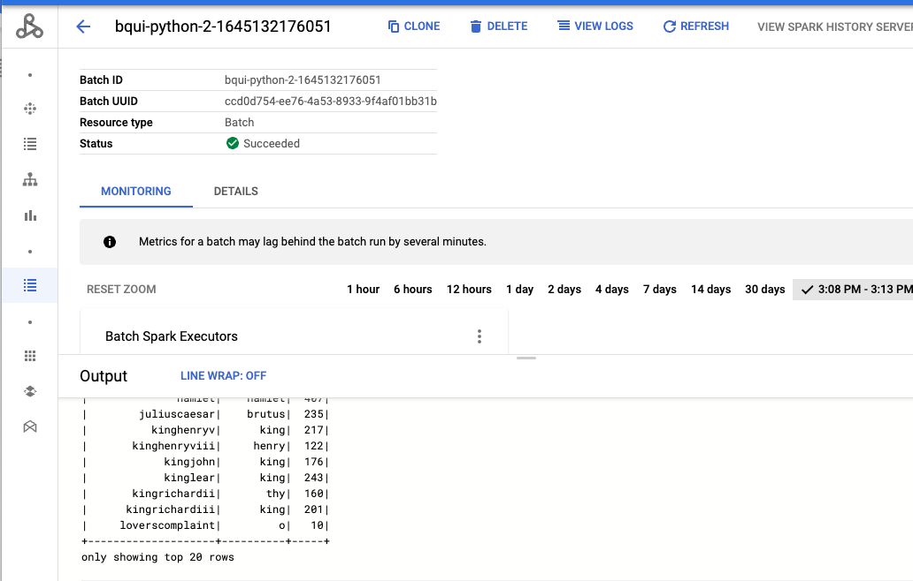

<br><br>

## 7. What if you want to list or kill a job?

Get a listing of jobs-
```
gcloud dataproc batches list --project $PROJECT_ID --region $LOCATION
```

Here are the author's list-
```
BATCH_ID: 7c93671131dc415f8c97c1dc3d899a29
JOB_TYPE: spark
STATUS: PENDING
```

To cancel the batch ID above, the command construct is as follows-
```
gcloud dataproc batches cancel 7c93671131dc415f8c97c1dc3d899a29 --project $PROJECT_ID --region $LOCATION
```

Sample result-
```
The batch [7c93671131dc415f8c97c1dc3d899a29] will be cancelled.
```

<hr>

## 8. How do you find the servereless spark logs in Cloud Logging?

Navigate to Cloud Logging on the cloud console, apply filters as shown below, to get to the logs-

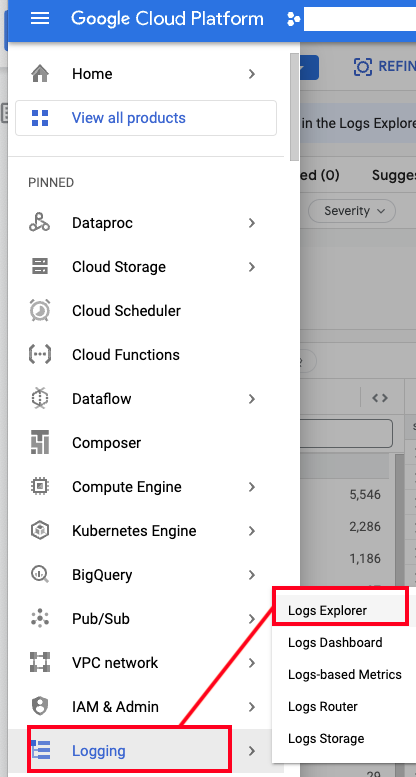

<br><br>

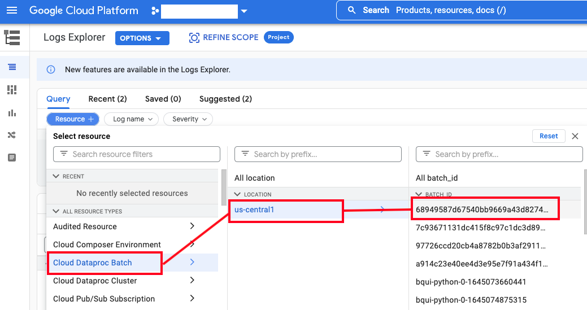

<br><br>

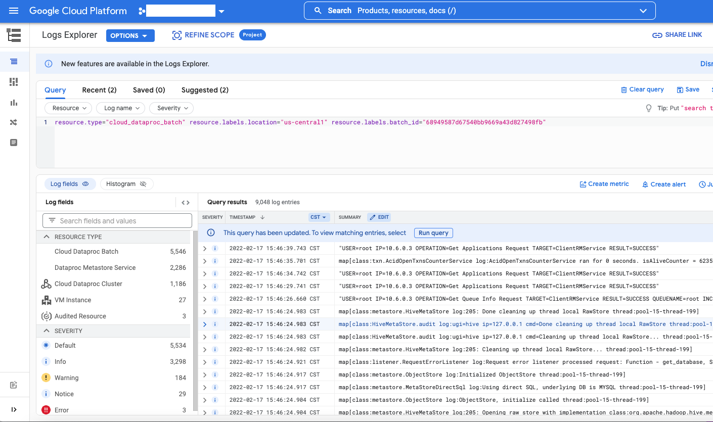

<br><br>

<hr>

This concludes the module. Proceed to the next module to learn how to submit serverless Apache Spark batch jobs to Dataproc.

<hr>

[Next Module](03-s8s-batch.md) 
<br>
[Repo Landing Page](https://github.com/anagha-google/spark-on-gcp-s8s)

<hr>

