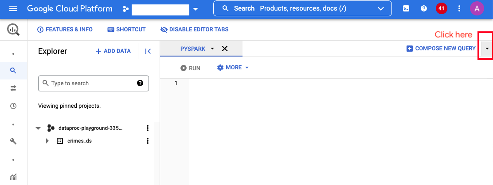
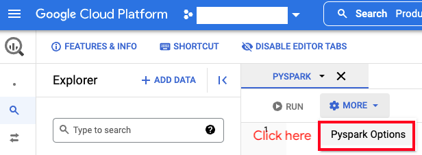
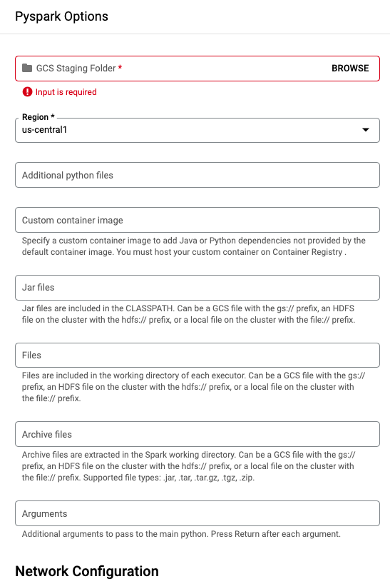

# About

This module covers basics of running Serverless Spark on GCP from the BigQuery UI, with a very basic set of examples.<br>

## 1. Pre-requisites:
a) The Spark on BigQuery feature, currently needs enabling for Argolis. Submit a request [here](https://docs.google.com/forms/d/e/1FAIpQLSccIXlE5gJNE0dNs6vQvCfrCcSjnoHqaW2lxpoVkAh56KLOwA/viewform) with your Argolis user principal name - admin@<your-org-name>, example admin@<your-ldap>.altostrat.com. <br>
  
b) Completion of the prior module<br>
  
  
## 2. Dependencies:  

  
## 1. Variables

In cloud shell on the cloud console, run the below-
```
#Replace as relevant to your environment

PROJECT_KEYWORD="vajra"  
BIGSPARK_CODE_BUCKET=gs://$PROJECT_KEYWORD-bigspark-$SVC_PROJECT_NBR-code
```
<hr>
  
  
## 2. Create a storage bucket for the PySaprk code

```
gsutil mb -p $SVC_PROJECT_ID -c STANDARD -l $LOCATION -b on $BIGSPARK_CODE_BUCKET
```

## 3. Navigate to the BigQuery UI for serveless PySpark

Follow the steps below to get to the BigQuery UI for serverless PySpark-
  
  
  
<br><br>
  
  
  
<br><br>
  
  
  
  
<br><br>
  
  
  
  
<br><br>
  
  


### 2.c. Paste the following into the notebook and execute

```
from pyspark.sql import SparkSession
from pyspark.ml.feature import StopWordsRemover
from pyspark.sql import functions as F

spark = SparkSession.builder \
  .appName('Top Shakespeare words')\
  .getOrCreate()

# Read data from BigQuery
df = spark.read \
  .format('bigquery') \
  .load('bigquery-public-data.samples.shakespeare')


# Convert words to lowercase and filter out stop words
df = df.withColumn('lowered', F.array(F.lower(df.word)))
remover = StopWordsRemover(inputCol='lowered', outputCol='filtered')
df = remover.transform(df)

# Create (count, word) struct and take the max of that in each corpus
df.select(df.corpus, F.struct(df.word_count, df.filtered.getItem(0).alias('word')).alias('count_word')) \
  .where(F.col('count_word').getItem('word').isNotNull()) \
  .groupby('corpus') \
  .agg({'count_word': 'max'}) \
  .orderBy('corpus') \
  .select(
     'corpus',
     F.col('max(count_word)').getItem('word').alias('word'),
     F.col('max(count_word)').getItem('word_count').alias('count')) \
  .show(20)

```

The results should something like this-
```
Using the default container image
PYSPARK_PYTHON=/opt/dataproc/conda/bin/python
JAVA_HOME=/usr/lib/jvm/temurin-11-jdk-amd64
SPARK_EXTRA_CLASSPATH=
:: loading settings :: file = /etc/spark/conf/ivysettings.xml
22/02/17 18:13:58 INFO DirectBigQueryRelation: Querying table bigquery-public-data.samples.shakespeare, parameters sent from Spark: requiredColumns=[corpus,word_count,word], filters=[]
22/02/17 18:13:58 INFO DirectBigQueryRelation: Going to read from bigquery-public-data.samples.shakespeare columns=[corpus, word_count, word], filter=''
22/02/17 18:14:01 INFO DirectBigQueryRelation: Created read session for table 'bigquery-public-data.samples.shakespeare': projects/.........

+--------------------+----------+-----+
|              corpus|      word|count|
+--------------------+----------+-----+
|        1kinghenryiv|     henry|  252|
|        1kinghenryvi|       thy|  157|
|        2kinghenryiv|  falstaff|  199|
|        2kinghenryvi|      thou|  187|
|        3kinghenryvi|      king|  249|
|allswellthatendswell|  parolles|  165|
|  antonyandcleopatra|    antony|  284|
|         asyoulikeit|  rosalind|  217|
|      comedyoferrors|  syracuse|  204|
|          coriolanus|coriolanus|  207|
|           cymbeline|    imogen|  137|
|              hamlet|    hamlet|  407|
|        juliuscaesar|    brutus|  235|
|          kinghenryv|      king|  217|
|       kinghenryviii|     henry|  122|
|            kingjohn|      king|  176|
|            kinglear|      king|  243|
|       kingrichardii|       thy|  160|
|      kingrichardiii|      king|  201|
|     loverscomplaint|         o|   10|
+--------------------+----------+-----+
only showing top 20 rows
```

### 2.d. Switch to the Dataproc UI - "Serverless Batches"

Notice that 


## 3. Lets try Spark SQL in BigQuery


```
from pyspark.sql import SparkSession

spark = SparkSession.builder \
  .appName('Chicago Crimes Analysis')\
  .getOrCreate()

# Read data from BigQuery
df = spark.read \
  .format('bigquery') \
  .load('bigquery-public-data.chicago_crime.crime')

# Count rows
# print(df.count)

# Create a temporary view
df.createOrReplaceTempView("chicago_crimes")

# Crimes count by year
crimesByYear_df=spark.sql("SELECT year,count(*) AS crime_count FROM chicago_crimes GROUP BY year ORDER BY year;")
crimesByYear_df.show()

# Crimes count by year for specific crime types
crimesByYearSpecific_df=spark.sql("SELECT cast(cast(year as string) as date) as case_year, primary_type as case_type, count(*) AS crime_count FROM chicago_crimes where primary_type in ('BATTERY','ASSAULT','CRIMINAL SEXUAL ASSAULT') GROUP BY case_year,primary_type ORDER BY case_year;")
crimesByYearSpecific_df.show()
```

