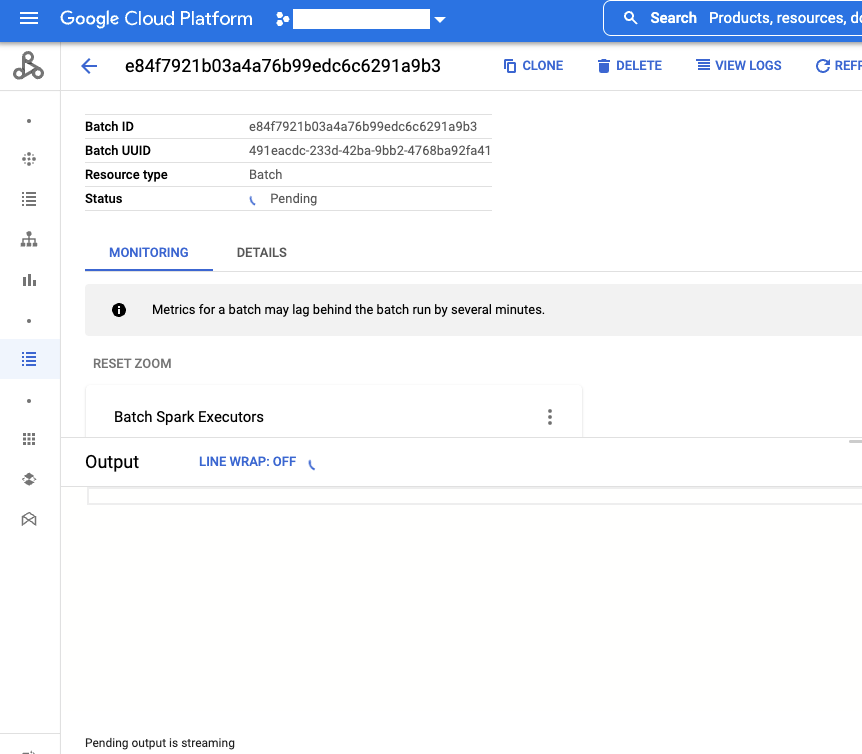
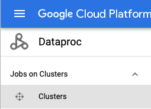
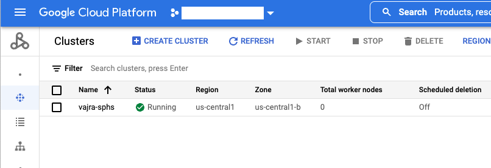
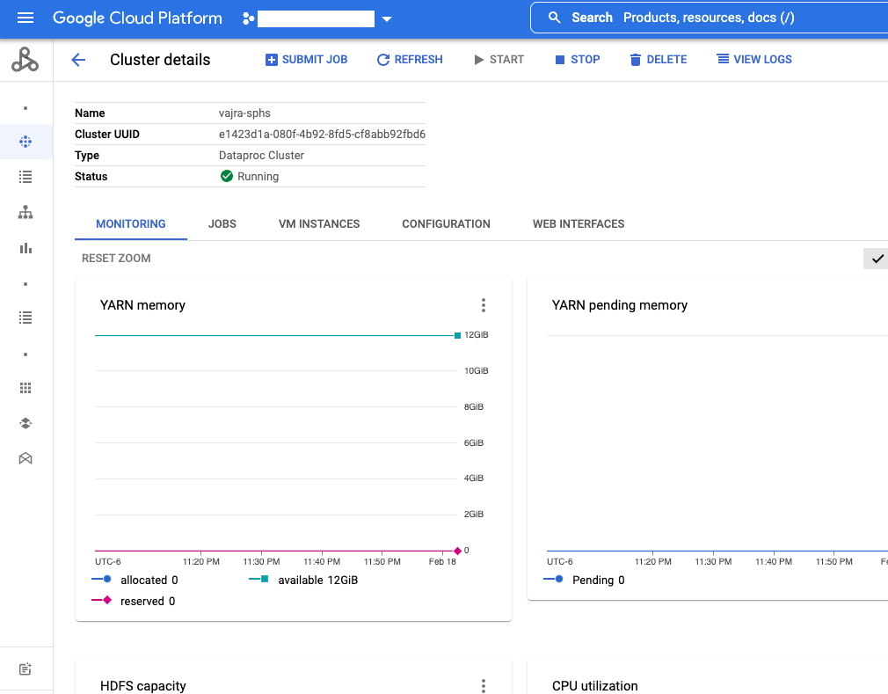
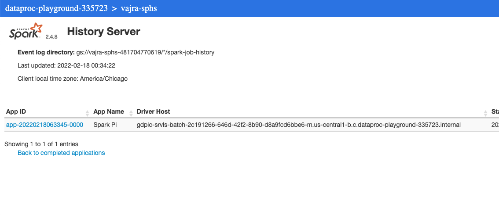

# About

This module covers running **serverless batch jobs** with very basic examples. It includes how to use a persistent Spark History Server and also a common Dataproc Metastore Service, provisioned as part of module 1.

Lets get started...

## Prerequisites

Completion of the [foundational setup module](foundational-setup.md).

## 1. Variables

Modify the varibles below as applicable for your environment and run the same in the cloud shell on the cloud console-

```
#Replace with your specific values from module 1
PROJECT_KEYWORD="trident"  
ORG_ID=<YOUR_ORG_ID>.altostrat.com                              
ORG_ID_NBR=<YOUR_ORG_NUMBER>
ADMINISTRATOR_UPN_FQN=admin@$ORG_ID 
PROJECT_NBR=<YOUR_PROJECT_NUMBER>                           
PROJECT_ID=<YOUR_PROJECT_ID>   

#Your public IP address, to add to the firewall
YOUR_CIDR=xx.xxx.xx.xx/32
              
LOCATION=us-central1

UMSA="$PROJECT_KEYWORD-sa"
UMSA_FQN=$UMSA@$PROJECT_ID.iam.gserviceaccount.com


SPARK_SERVERLESS_NM=$PROJECT_KEYWORD-s8s
SPARK_SERVERLESS_DATA_BUCKET=gs://$SPARK_SERVERLESS_NM-$PROJECT_NBR-data
SPARK_SERVERLESS_SQL_BUCKET=gs://$SPARK_SERVERLESS_NM-$PROJECT_NBR-sql
SPARK_SERVERLESS_CLUSTER_BUCKET=gs://$SPARK_SERVERLESS_NM-$PROJECT_NBR

PERSISTENT_HISTORY_SERVER_NM=$PROJECT_KEYWORD-sphs
PERSISTENT_HISTORY_SERVER_BUCKET=gs://$PERSISTENT_HISTORY_SERVER_NM-$PROJECT_NBR
DATAPROC_METASTORE_SERVICE_NM=$PROJECT_KEYWORD-dpms

VPC_NM=$PROJECT_KEYWORD-vpc
SPARK_SERVERLESS_SUBNET=$SPARK_SERVERLESS_NM-snet
SPARK_CATCH_ALL_SUBNET=$PROJECT_KEYWORD-misc-snet
```

<br><br>
<hr>

## 2. Run a simple batch job (SparkPi)

On cloud shell in the cloud console, run the following command to start a serverless batch job that calculates and prints the value of Pi. This is a great test for smoke-testing environment setup.

```
gcloud dataproc batches submit spark \
--project=$PROJECT_ID \
--region=$LOCATION \
--subnet projects/$PROJECT_ID/regions/$LOCATION/subnetworks/$SPARK_SERVERLESS_SUBNET \
--jars=file:///usr/lib/spark/examples/jars/spark-examples.jar \
--class org.apache.spark.examples.SparkPi -- 10000
```

You should see results in cloud shell similar to this-
  
  
<br><br>

Lets navigate in Cloud Console to the Dataproc service and go to "Serverless" and look at the logs-


  
  
<br><br>

  
  
<br><br>

  
  
<br><br>


<br><br>
<hr>

## 3. Run a simple batch job (SparkPi) with Persistent Spark History Server

Lets repeat the same job, this time with the persistent history server we created in the [foundational setup module](foundational-setup.md).<br>
All we need to do is add the following to the command-
```
--history-server-cluster=projects/$PROJECT_ID/regions/$LOCATION/clusters/$PERSISTENT_HISTORY_SERVER_NM
```
<br>

On cloud shell in the cloud console, run the following command that includes the persistent spark history server-
```
gcloud dataproc batches submit spark \
--project=$PROJECT_ID \
--region=$LOCATION \
--subnet projects/$PROJECT_ID/regions/$LOCATION/subnetworks/$SPARK_SERVERLESS_SUBNET \
--jars=file:///usr/lib/spark/examples/jars/spark-examples.jar \
--history-server-cluster=projects/$PROJECT_ID/regions/$LOCATION/clusters/$PERSISTENT_HISTORY_SERVER_NM \
--class org.apache.spark.examples.SparkPi -- 10000
```

Lets look at the logs-

  
  
<br><br>

Lets navigate on the cloud console to the Persistent Spark History Server

 
 
<br><br>

 
 
<br><br>

 
 
<br><br>

 
 
<br><br>

 
 
<br><br>

 
 
<br><br>

 
 
<br><br>

<br><br>
<hr>

## 4. Run a batch job with structured data using Dataproc Metastore Service

### 4.1. Create a GCS bucket for the data and the sql for the spark-sql demo respectively
```
gsutil mb -p $PROJECT_ID -c STANDARD -l $LOCATION -b on $SPARK_SERVERLESS_DATA_BUCKET
gsutil mb -p $PROJECT_ID -c STANDARD -l $LOCATION -b on $SPARK_SERVERLESS_SQL_BUCKET
```

### 4.2. Create a CSV and persist to GCS

In Cloud Shell, create a CSV

You should see the below-
```
rm sherlock-books.csv

cat > sherlock-books.csv << ENDOFFILE
"b00001","Arthur Conan Doyle","A study in scarlet",1887
"b00023","Arthur Conan Doyle","A sign of four",1890
"b01001","Arthur Conan Doyle","The adventures of Sherlock Holmes",1892
"b00501","Arthur Conan Doyle","The memoirs of Sherlock Holmes",1893
"b00300","Arthur Conan Doyle","The hounds of Baskerville",1901
ENDOFFILE

```

### 4.3. Copy the file to the bucket

```
gsutil cp sherlock-books.csv $SPARK_SERVERLESS_DATA_BUCKET
```

### 4.4. Create the external table definition (one time activity)

In Cloud Shell, 

a) Create a hql file

You should see the below-
```
rm sherlock-books.hql

cat > sherlock-books.hql << ENDOFFILE
CREATE EXTERNAL TABLE books(book_id string,author_nm string,book_nm string,pulication_yr int) ROW FORMAT DELIMITED FIELDS TERMINATED BY "," LOCATION "$SPARK_SERVERLESS_DATA_BUCKET/"
ENDOFFILE
```

b) Copy the hql file to the SQL bucket-
```
gsutil cp sherlock-books.hql $SPARK_SERVERLESS_SQL_BUCKET
```
 
### 4.5. Submit the job to create the table defintion in the metastore

```
DATAPROC_METASTORE_SERVICE_NM=$PROJECT_KEYWORD-dpms

gcloud dataproc batches submit spark-sql \
  --project=${PROJECT_ID} \
  --region=${LOCATION} \
  --subnet=projects/$PROJECT_ID/regions/$LOCATION/subnetworks/$SPARK_SERVERLESS_SUBNET \
  --metastore-service=projects/$PROJECT_ID/locations/$LOCATION/services/$DATAPROC_METASTORE_SERVICE_NM  \
  $SPARK_SERVERLESS_SQL_BUCKET/sherlock-books.hql
```

### 4.6. Submit a query against the external table

a) Create a hql file

You should see the below-
```
rm sherlock-books.hql

cat > sherlock-books-count.hql << ENDOFFILE
SELECT count(*) AS book_count FROM books
ENDOFFILE
```

b) Copy the hql file to the SQL bucket-
```
gsutil cp sherlock-books-count.hql $SPARK_SERVERLESS_SQL_BUCKET
```

c) Run query
```
DATAPROC_METASTORE_SERVICE_NM=$PROJECT_KEYWORD-dpms

gcloud dataproc batches submit spark-sql \
  --project=${PROJECT_ID} \
  --region=${LOCATION} \
  --subnet=projects/$PROJECT_ID/regions/$LOCATION/subnetworks/$SPARK_SERVERLESS_SUBNET \
  --metastore-service=projects/$PROJECT_ID/locations/$LOCATION/services/$DATAPROC_METASTORE_SERVICE_NM  \
  --deps-bucket=$SPARK_SERVERLESS_CLUSTER_BUCKET \
  $SPARK_SERVERLESS_SQL_BUCKET/sherlock-books-count.hql
```

You should see it emit the record count in the output.

<br><br>
<hr>

This concludes the module.
